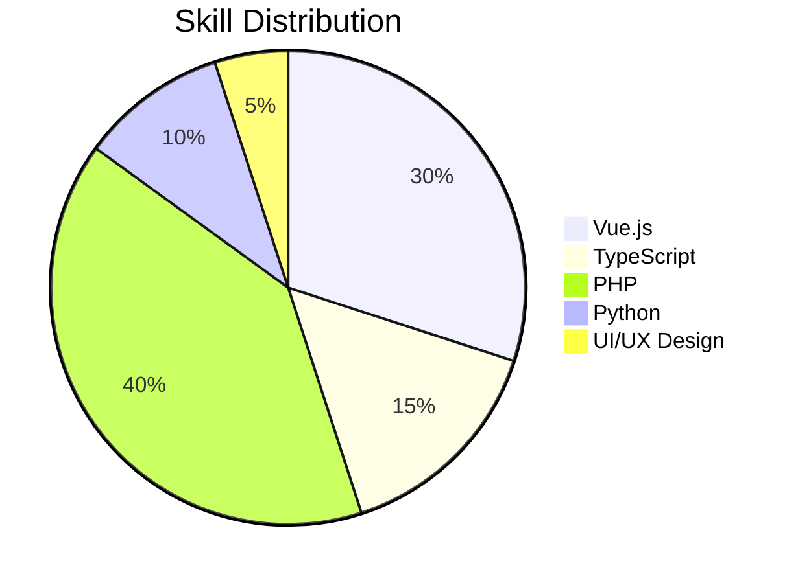

# 👨‍🌾 Amr Ibrahim - Agronomist & Developer

## About Me

I'm passionate about science and problem-solving, which drives my love for both agronomy and software development. I enjoy building things from the ground up because it brings me joy, and I constantly seek to improve and learn for fun. As an avid reader, I'm detail-oriented and strive for perfection, always aiming to meet the highest standards in my work.

## 🌱 Current Endeavors

- Enhancing Fast Stack to support React Native and improve flexibility
- Exploring AI applications in agriculture
- Contributing to open-source projects related to AgriTech

## 🎯 2024 Goal

Build a project with **$500 USD/month** in revenue

## 🔧 Skills

## 💻 Tech Stack

### Languages

  

### Frameworks & Libraries

  

### Tools & Platforms

  

## 📊 GitHub Stats

## 📌 Featured Projects

Majestic Minds

A platform built from scratch, handling everything from market research to UI/UX design and development.

- **Website:** [majesticminds.net](https://majesticminds.net)
- **Tech Stack:**
  - **Frontend:** TypeScript, Vue 3, Composition API, Naive UI, Tailwind CSS, Pinia, Vue Router
  - **Admin Panel:** Vue 3, PrimeVue, TypeScript, Pinia
- **UI Design:** Powered by AI using Uizard
- **Status:** Completed and Live

Fast Stack

A code generator that builds full-stack code in seconds.

- **Tech Stack:** Python, Claude AI
- **Features:**
  - Generates full-stack code rapidly
  - Currently being enhanced to support React Native
  - Integration with Claude AI for accelerated code generation
- **Status:** In active development

## 📫 Let's Connect

## ⚡ Fun Facts

- Avid anime watcher 📺
- Passionate gamer 🎮
- Science enthusiast 🔬

---

  

